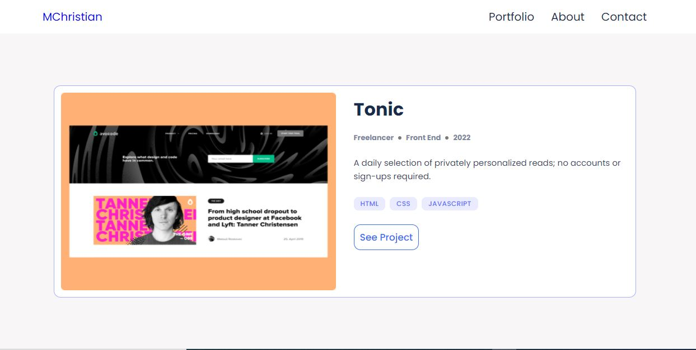
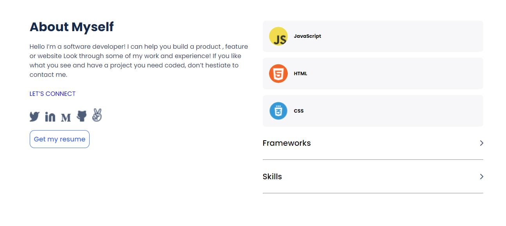

# Portfolio

> Portfolio of Microverse projects

>  >  > 

This project is a portfolio project I'm building at Microverse.

Things done so far in the project:

#### 1. Build mobile skeleton

- Parse a Figma design
- Use Flexbox and CSS Grid for positioning
- Use images and backgrounds

## Built With

- Major languages: HTML, CSS
- Technologies used: Lighthouse, Webhint, Stylelint

## Live Demo

[Live Demo Link](https://kaitcham.github.io/Portfolio/)

## Getting Started

To get a local copy up and running follow these simple example steps.

Use the following command in your terminal:

- **To clone the main project**

```
git clone https://github.com/kaitcham/Portfolio
```

- **To clone the mobile-skeleton branch**

```
git clone -b mobile-skeleton https://github.com/kaitcham/Portfolio/mobile-skeleton
```

## Authors

👤 **Kait Cham**

- GitHub: [@kaitcham](https://github.com/kaitcham)
- Twitter: [@kaitcham](https://twitter.com/kaitcham)
- LinkedIn: [kaitcham](https://linkedin.com/in/kaitcham)

## 🤝 Contributing

Contributions, issues, and feature requests are welcome!

Feel free to check the [issues page](https://github.com/kaitcham/Portfolio/issues).

## Show your support

Give a ⭐️ if you like this project!

## 📝 License

This project is [MIT](./MIT.md) licensed.
